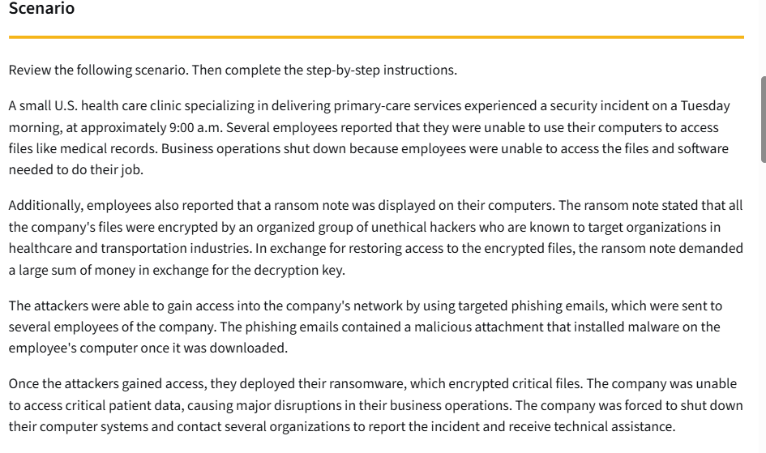

# Ransomware Incident Handler Journal

## Overview

This project documents a ransomware incident investigation involving a healthcare clinic that experienced a phishing-based malware attack resulting in encrypted systems and disrupted business operations.

The investigation applies incident response documentation techniques using an incident handler’s journal and the 5 W’s framework to analyze the attack, identify the cause, assess operational impact, and document response considerations.

---

## Scenario

A U.S. healthcare clinic experienced a ransomware attack after employees received phishing emails containing malicious attachments. Once downloaded, the malware allowed attackers to deploy ransomware across organizational systems.

Critical patient files and medical systems became inaccessible, forcing business operations to shut down. Attackers demanded payment in exchange for a decryption key.

---

## Incident Summary

- Phishing emails delivered malicious malware attachments
- Ransomware encrypted organizational files
- Employees lost access to medical records and business systems
- Healthcare operations were disrupted
- A ransom note demanded payment for file recovery

---

## Investigation Areas

- Phishing attack analysis
- Malware infection vector
- Ransomware deployment
- Business impact assessment
- Incident documentation
- The 5 W's framework
- Security response considerations

---

## Key Findings

- The attack originated through phishing emails sent to employees
- Malware installation enabled unauthorized network access
- Ransomware encrypted critical healthcare systems and files
- Patient care operations were disrupted due to unavailable records
- Healthcare organizations remain high-value ransomware targets

---

## Security Concepts

- Phishing Attacks
- Ransomware
- Malware Delivery
- Incident Response
- Business Continuity
- Social Engineering
- Security Awareness
- Cybersecurity Documentation

---

## Visual Reference

---

## Repository Structure

- `incident-analysis.md`
- `five-ws-analysis.md`
- `incident-timeline.md`
- `additional-notes.md`

Supporting documentation is stored in the `docs/` directory.

---

## References

- [Incident Handler's Journal Template](docs/incident-handlers-journal.pdf)
- NIST Incident Response Lifecycle
- CISA Ransomware Guidance
- Phishing Awareness Best Practices
